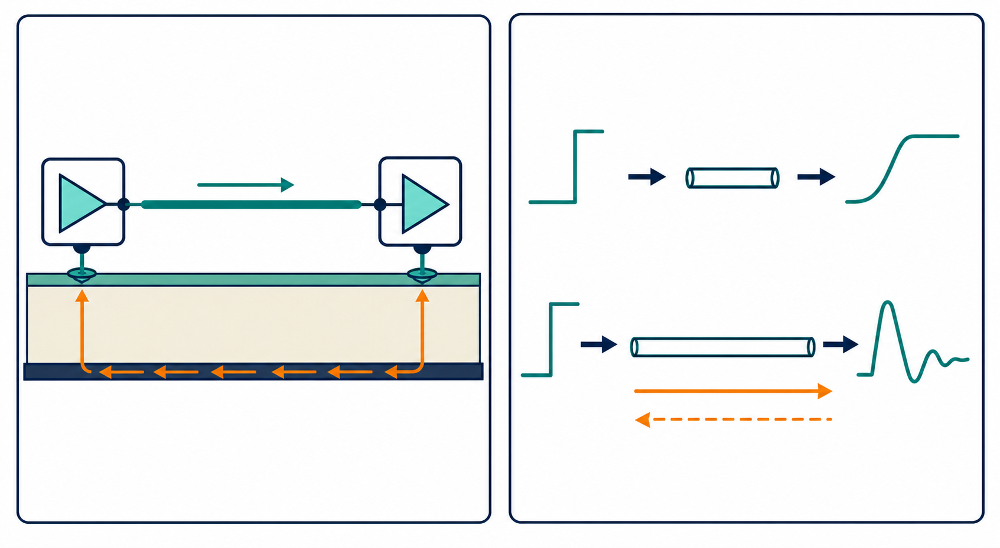

# 01：SI／PI 到底在解決什麼問題？

## 先記住這三句話

**SI 是確認訊號能不能安全抵達。**

**PI 是確認晶片需要電時，電源會不會突然塌下來。**

**分析前先畫出訊號怎麼走、電流怎麼回來。**

## 這一章要學會什麼

- 看懂 SI 和 PI 的差別。
- 找到 source、channel、load 和 return path。
- 了解為什麼數位訊號也要用類比電路的方法分析。

## 1. SI 和 PI 是什麼？

**SI 看訊號，PI 看電源；但兩者最後會互相影響。**

SI 就像送包裹。你不只要知道包裹最後是「有」或「沒有」，還要確認它有沒有遲到、摔壞或送錯地址。

在電路裡，這些問題會變成訊號太慢、反射、串擾、損耗、jitter 或 BER 太高。

PI 則像自來水管。晶片突然需要更多電流時，如果管路太細或太遠，電壓就會下降。

電源雜訊會改變 I/O buffer 的輸出；訊號切換也會把電流變化丟進 PDN。所以 SI 和 PI 常常要一起看。

## 2. 為什麼一條線不能永遠當成「電線」？

**只要訊號跑完一段線的時間，已經接近訊號邊緣變化的時間，這條線就要當傳輸線看。**

想像你在走廊喊一聲。走廊很短時，回音還沒回來，你就已經喊完了；走廊很長時，回音會在你說話時回來，聲音就會混在一起。

高速訊號也是一樣。即使 clock 只有 100 MHz，只要 rise time 是 100 ps，訊號邊緣仍然可能很快。

所以判斷模型時，先看 rise time 和線長，不要只看 clock frequency。

## 3. 先找四個角色

**所有 SI 問題，都可以先拆成「誰送、經過哪裡、誰接、電流怎麼回去」。**

| 角色 | 白話問題 |
|---|---|
| Source | 誰在送訊號？它推得多快？ |
| Channel | 訊號經過哪些線、via、connector 和 package？ |
| Load | 誰在接收？它的終端和判斷門檻如何？ |
| Return path | 電流走什麼路回去？有沒有被切斷？ |

初學者最容易漏掉 return path。高速電流一定會形成完整迴路；參考平面被切開或換層沒有良好回流時，訊號就可能變差。

## 4. 建議照這個順序做

1. 寫規格：電壓、rise time、允許 overshoot、timing 或 BER。
2. 畫出 source、channel、load 和 return path。
3. 先用簡單模型找主因。
4. 確定主因後，再加入 package、via、connector 和材料損耗。
5. 最後拿模擬和量測對照。

## 小練習

一條 50 Ω 單端線長 10 cm，driver 的 rise time 是 100 ps。

1. 你會先用普通電路模型，還是傳輸線模型？
2. 如果 receiver 端有振鈴，你會先檢查哪三件事？
3. 如果旁邊還有一條同時切換的訊號，你還需要知道什麼？

## 一句話結論

**SI／PI 的重點不是先按哪個工具按鈕，而是先把訊號路徑、回流路徑和問題規格畫清楚。**
