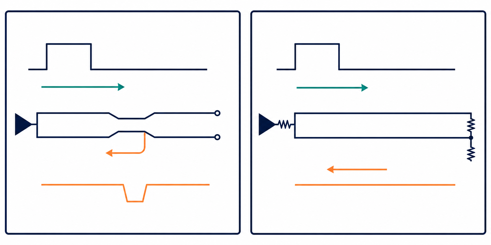

# 02：反射為什麼會發生？



## 先記住這三句話

**訊號遇到阻抗改變，就像球撞到牆，會有一部分彈回來。**

**阻抗差越大，彈回來的波越大。**

**加終端電阻前，先找出是哪個地方不匹配。**

## 1. 反射是怎麼來的？

**傳輸線上的電壓和電流有固定比例；比例突然改變時，波就會反彈。**

把傳輸線想成寬度固定的道路。車流突然遇到窄橋，部分車流就會回堵。阻抗不連續就是高速訊號遇到的「窄橋」。

可能造成阻抗改變的地方包括線寬、via、connector、package、stub 和 receiver 終端。

## 2. 反射係數怎麼看？

反射係數是：

```text
Γ = (ZL − Z0) / (ZL + Z0)
```

`Z0` 是原本傳輸線的阻抗，`ZL` 是它撞到的負載阻抗。

例如傳輸線是 50 Ω，負載是 75 Ω：

```text
Γ = (75 − 50) / (75 + 50) = 0.2
```

意思是電壓有 20% 以同方向反射回來。

| 情況 | 會看到什麼 |
|---|---|
| 負載和線一樣是 50 Ω | 幾乎沒有反射 |
| 負載大於 50 Ω | 向上的反射 |
| 負載小於 50 Ω | 向下的反射 |
| 開路 | 幾乎全部同方向反射 |
| 短路 | 幾乎全部反方向反射 |

## 3. 為什麼會振鈴？

**振鈴通常是多個反射在不同時間回來，疊在一起造成的。**

一條實際通道可能是：

```text
Driver → package → trace → via → connector → trace → receiver
```

每個地方都可能有一點反射。看到振鈴時，先問：它何時開始？週期是否對應某段線的往返時間？哪個 via、stub 或 connector 最可疑？

## 4. 三種終端方式

### Source termination：在起點加電阻

讓 driver 的輸出阻抗加上電阻後，接近傳輸線阻抗。DC 功耗低，適合點對點連線；缺點是訊號一開始可能只有約一半振幅。

### Load termination：在終點接住訊號

在 receiver 端放匹配終端，減少訊號抵達終點時的反彈。波形通常較乾淨，但可能一直消耗 DC 功率。

### AC termination：只處理快速變化

用電阻和電容一起處理高速邊緣，減少穩態 DC 功耗。效果取決於電容值、rise time、資料型態和拓撲。

## 5. 我會先選哪個改善方向？

### A. 先修結構

修正線寬、via、stub、connector 或參考平面。這是我會優先選的方式，因為它直接處理反射來源。

### B. 加終端

結構已固定，或需要快速驗證假設時，再嘗試終端。它比較快，但可能增加功耗或造成新的問題。

## 小練習

50 Ω 傳輸線接到 75 Ω 負載。

1. 反射係數是多少？
2. 反射波是向上還是向下？
3. 若固定延遲後出現第二個階梯，你會先查 stub、source 還是 receiver？

## 一句話結論

**反射不是「波形不好看」而已；它是阻抗不連續留下的線索。先找線索，再選終端。**
