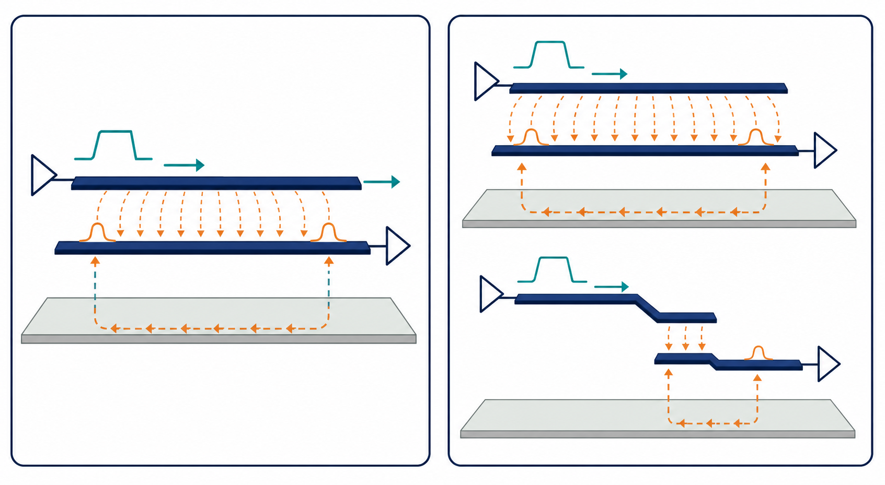

# 05：串擾與回流路徑

## 先記住這三句話

**串擾就是隔壁訊號把自己的變化「漏」過來。**

**平行走得越久、距離越近，通常串擾越嚴重。**

**改善串擾時，要同時看 signal path 和 return path。**

## 1. 串擾是什麼？

**兩條靠近的高速線，就像兩間共用薄牆的房間。**

一間房間裡有人大聲說話，隔壁會聽到聲音。PCB 上的電場和磁場也會從一條線耦合到另一條線。

- 正在傳送訊號的線叫 aggressor。
- 被影響的線叫 victim。
- 被影響的波形叫 crosstalk。

串擾不一定會造成錯誤，但如果 victim 本來就接近接收門檻，少量串擾也可能讓它誤判。

## 2. 什麼會讓串擾變大？

**距離、平行長度和訊號邊緣速度，是最先要看的三件事。**

串擾常會隨著下列條件變嚴重：

- 兩條線距離太近。
- 兩條線平行走太長。
- aggressor 的 rise time 很快。
- 參考平面不連續。
- 多條線同時切換。

即使 clock frequency 沒變，只要 driver 換成更快的 buffer，串擾也可能變大。

## 3. NEXT 和 FEXT 是什麼？

**NEXT 和 FEXT 的差別，主要是看串擾在哪一端被量到。**

- NEXT：近端串擾，在 aggressor 注入訊號的同一端附近看到。
- FEXT：遠端串擾，在 victim 的另一端附近看到。

可以想成你在水管一端快速推水：靠近你這端先看到擾動，另一端也可能稍後看到波動，但大小和方向會受到線長與結構影響。

## 4. 回流路徑為什麼會影響串擾？

**回流如果不能走短路徑，訊號的電磁場就會擴散，串擾和輻射都可能增加。**

當 signal trace 跨過 plane split，回流不能直接走在訊號下方，只能繞路。這會讓迴路面積變大，也讓鄰近線路更容易受到影響。

換層時，如果兩個參考平面不是同一個電氣環境，也要提供合適的 stitching via，讓回流能順利轉換。

## 5. 改善串擾的兩個選擇

### A. 拉大距離

這是我會優先選的方式。增加線距通常能直接降低耦合，但要付出 PCB 面積。

### B. 縮短平行長度

如果不能拉大整段距離，就讓兩條線不要長時間平行。可以改走線方向或讓其中一條提早轉彎。

我會先選 A；如果空間不夠，再用 B。加 guard trace 不是萬用解法，仍要確認它有良好接地和正確的回流路徑。

## 小練習

一條 aggressor 和一條 victim 平行走 100 mm，兩線距離 4 mil。你打算修改設計。

1. 第一個優先修改線距，還是把平行長度縮短？
2. 如果兩條線必須靠近，還要檢查哪一個參考平面問題？
3. 如何從波形判斷 victim 的尖峰可能是 NEXT 還是 FEXT？

## 一句話結論

**串擾不是只看兩條線隔多遠，也要看電場、磁場和回流路徑被限制得好不好。**
