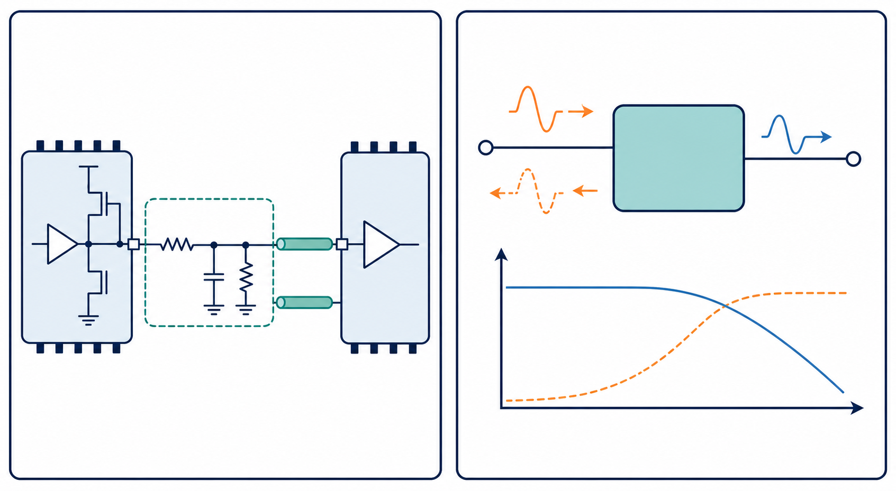

# 07：I/O Model、IBIS 與 S 參數

## 先記住這三句話

**I/O model 是把晶片腳位的行為交給模擬器重現。**

**S 參數是描述一個通道對不同頻率訊號做了什麼。**

**模型不是越複雜越好，而是要和問題的頻率範圍相配。**

## 1. 為什麼不能只用理想電壓源？

**理想電壓源太完美，無法代表真正的晶片。**

真實的 I/O buffer 會受到輸出阻抗、電源電壓、負載、上升時間和封裝寄生效應影響。如果只用 0 V 和 1 V 的理想方波，模擬結果可能比實際波形樂觀很多。

I/O model 就像演員的替身。它不一定把晶片內部每個電晶體都畫出來，但會保留外部觀察得到的主要行為。

## 2. IBIS 是什麼？

**IBIS 用表格描述 I/O 腳位的電流和電壓關係。**

它通常包含：

- pull-up、pull-down 行為。
- 上升和下降的波形。
- 輸入閘值。
- 封裝寄生 R、L、C。
- 不同電壓和溫度條件。

這樣做的好處是模型不需要公開晶片內部電路，也能讓 SI 工具模擬腳位和通道的互動。

## 3. S 參數在說什麼？

**S 參數是在問：從某個 port 送進去的波，有多少被傳到另一端，有多少被反射回來？**

以兩 port 通道為例：

- `S11`：從 port 1 送入後，回到 port 1 的比例。
- `S21`：從 port 1 送入後，傳到 port 2 的比例。
- `S22`：從 port 2 送入後，回到 port 2 的比例。
- `S12`：從 port 2 傳回 port 1 的比例。

如果 `S21` 在 10 GHz 是 −3 dB，代表訊號功率只剩約一半；如果看的是電壓振幅，約剩 0.707 倍。

## 4. 模型檢查要看什麼？

**使用模型前，先確認它是不是在正確的頻率、port 和參考阻抗下建立。**

至少檢查：

1. port 順序是否正確。
2. 單位是 Hz、MHz 還是 GHz。
3. 參考阻抗是不是 50 Ω。
4. 插入損耗是否合理。
5. 模型是否出現不合理的增益或非因果波形。

## 小練習

一個通道在 5 GHz 的 `S21` 是 −6 dB。

1. 功率大約剩下多少？
2. 如果接收端波形比預期小，你會先檢查模型、終端，還是量測 probe？
3. 如果模型的頻率只到 4 GHz，能不能直接拿來分析 10 GHz 的邊緣？

## 一句話結論

**模型的價值不是讓模擬器有資料可跑，而是讓模擬結果能代表真實元件和通道。**
