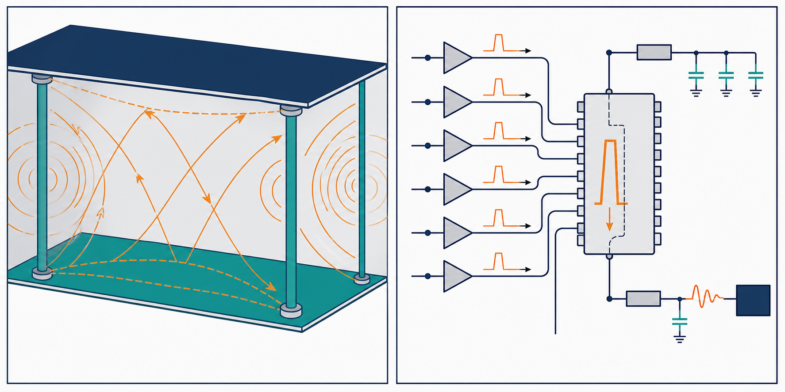

# 08：平面、SSN 與封裝／PCB



## 先記住這三句話

**電源平面不是一塊理想金屬，而是一個會共振的電磁結構。**

**很多 I/O 同時切換時，會把電流脈衝注入電源和地。**

**封裝、PCB 和晶片要看成同一條電流路徑。**

## 1. 電源平面為什麼會共振？

**兩片平行平面之間，就像一個很大的、形狀不規則的共鳴腔。**

當高速電流在平面上移動，邊界、via 和平面尺寸會讓某些頻率的能量被反射回來。如果反射剛好互相加強，就會出現平面共振。

這些共振可能造成局部電源雜訊、EMI 或訊號回流路徑改變。

## 2. SSN 是什麼？

**SSN 是很多輸出同時切換時，電源和地被一起晃動。**

假設 16 個 I/O 同時切換，每個腳位的瞬間電流變化是 20 mA，總電流變化可能接近：

```text
16 × 20 mA = 320 mA
```

如果封裝和回流路徑的等效電感是 1 nH，電流在 100 ps 內變化，感應電壓約為：

```text
V = L × di/dt = 1 nH × 0.32 A / 100 ps = 3.2 V
```

這是簡化估算，實際結果還會受到電阻、去耦、電源阻抗和同時切換數量影響；但它說明了為什麼很小的封裝電感也可能造成明顯雜訊。

## 3. 為什麼封裝不能忽略？

**封裝是晶片和 PCB 之間的最後一段路，卻常常有不可忽略的寄生電感。**

訊號從 die 到 package ball，再到 PCB via，每一段都可能造成阻抗變化。電源從 decoupling capacitor 走到 die，也同樣會經過封裝電感。

## 4. 兩個改善方向

### A. 縮短高頻電流迴路

我會優先選這個方向。讓電容、via、plane 和負載彼此靠近，降低迴路電感。

### B. 降低同時切換的尖峰

可以調整 drive strength、slew rate、I/O 時序或 pin assignment，讓大量電流不要在同一瞬間出現。

## 小練習

某 I/O bank 有 8 個腳位同時切換，每個腳位電流變化 25 mA。

1. 總電流變化約是多少？
2. 如果回流電感增加一倍，SSN 可能如何變化？
3. 你會先改封裝、去耦位置，還是 I/O slew rate？

## 一句話結論

**SSN 不是單一晶片問題，而是 die、封裝、電源平面和回流路徑一起造成的系統問題。**
