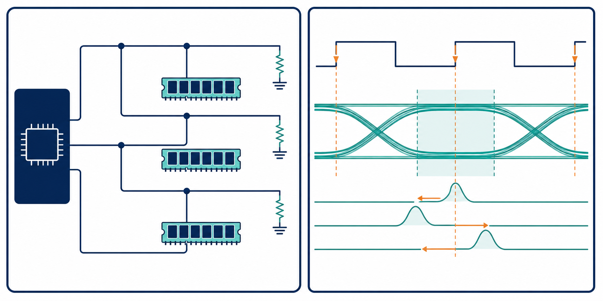

# 09：DDR4／DDR5 記憶體介面



## 先記住這三句話

**DDR 設計不是只把線接通，而是要讓資料和時脈在正確時間抵達。**

**拓撲、終端、SSN 和 timing margin 必須一起看。**

**DDR 通道的問題通常要從 topology 和最差 corner 開始查。**

## 1. DDR 為什麼難？

**DDR 在時脈的上升和下降邊緣都傳送資料，所以可用時間比看起來更緊。**

如果資料率是 3200 MT/s，每個資料單位的時間約為：

```text
1 ÷ 3.2 GHz = 312.5 ps
```

在 312.5 ps 的時間格裡，封裝、PCB、via、driver、雜訊和 jitter 都要分配自己的誤差空間。

## 2. Topology 是什麼？

**Topology 就是訊號從 controller 到 memory 的實際道路形狀。**

常見形式包括：

- point-to-point：一個 driver 對一個 receiver。
- fly-by：訊號依序經過多個記憶體元件。
- 分支 topology：一條主線分成多條支線。

每多一個分支，就多一個可能反射的地方。DDR 不只是看線長，還要看分支和終端的位置。

## 3. Timing margin 怎麼理解？

**Timing margin 就是資料在安全取樣區間裡還剩多少空間。**

假設有效取樣窗是 100 ps，而總誤差包含：

- jitter：25 ps。
- skew：20 ps。
- 反射造成的不確定性：15 ps。

剩餘 margin 約為：

```text
100 ps − 25 ps − 20 ps − 15 ps = 40 ps
```

這只是示意算法，正式 sign-off 還要依規格定義各項誤差是否直接相加、以統計方式合併或分配到不同 corner。

## 4. DDR 的優先檢查順序

1. 先確認 topology 和終端。
2. 再確認資料、時脈和 strobe 的相對長度。
3. 檢查參考平面和換層回流。
4. 加入 IBIS、封裝和 SSN 模型。
5. 在電壓、溫度、製程和負載 corner 下重新檢查。

## 小練習

一個 DDR 通道的資料單位時間是 312.5 ps，已知 jitter 30 ps、skew 25 ps、反射不確定性 20 ps。

1. 用簡化相減方式估算剩餘空間。
2. 哪一項改善最可能直接增加 timing margin？
3. 如果只有某一顆 memory fail，你會先查整條 topology 還是該顆附近的 via 和終端？

## 一句話結論

**DDR 的核心是管理時間和反射，所有 layout 和 SI 改善最後都要回到 data eye 與 timing margin。**
