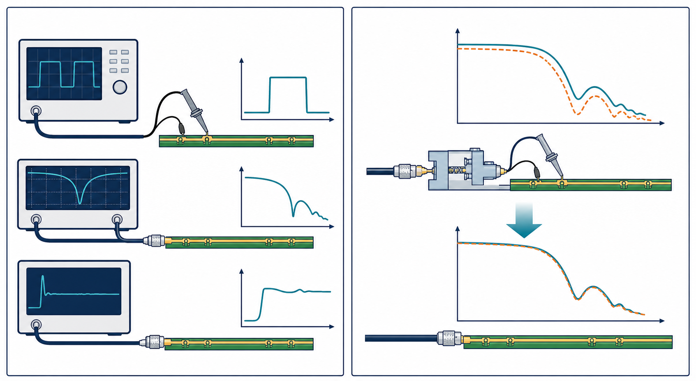

# 11：量測、驗證與除錯

## 先記住這三句話

**量測不是把探棒碰上去就得到真實答案。**

**探棒、fixture、校正和 de-embedding 都是量測鏈的一部分。**

**模擬和量測不一致時，不要先怪其中一邊，先拆解差異來源。**

## 1. 為什麼探棒會改變結果？

**探棒不是透明的，它會增加電容、電感和額外的連接路徑。**

如果探棒輸入電容是 1 pF，訊號邊緣很快時，它在高頻下可能已經形成明顯負載。探棒接地線太長，也可能增加迴路電感，讓波形出現假的振鈴。

## 2. 三種常見工具

### 示波器

看時間域波形、overshoot、jitter、eye 和 trigger 事件。

### VNA

看頻率域的 insertion loss、return loss、相位和群延遲。

### TDR

把反射轉成距離，幫你定位哪一段結構可能有阻抗問題。

同一個問題可以用不同工具看，但每種工具回答的問題不同。

## 3. 模擬和量測差異怎麼查？

**先對齊量測邊界，再比較波形，不要直接拿兩條曲線疊在一起。**

建議順序：

1. 確認模擬和量測的 port 位置是否相同。
2. 確認是否包含 connector、fixture 和 probe。
3. 確認量測是否做了校正或 de-embedding。
4. 對齊時間零點、頻率範圍和參考阻抗。
5. 先比較延遲和主要峰值，再比較細節。

## 4. 看到失效波形時怎麼開始？

### A. 先看時間位置

振鈴在固定延遲後出現，可能指向某段線、stub 或 connector。

### B. 再做一個最小實驗

只改一個因素，例如換一個 probe、移除一段 cable、改變終端或縮短 stub。這樣才知道結果是不是由那個因素造成。

## 小練習

模擬波形沒有振鈴，量測波形卻在 1 ns 後出現固定週期振鈴。

1. 你會先查 probe、fixture，還是 driver model？
2. 為什麼「固定延遲」是一個重要線索？
3. 下一個實驗只允許改一個因素，你會改什麼？

## 一句話結論

**好的除錯不是找一個看起來合理的答案，而是設計一個小實驗，把可能原因逐一排除。**
