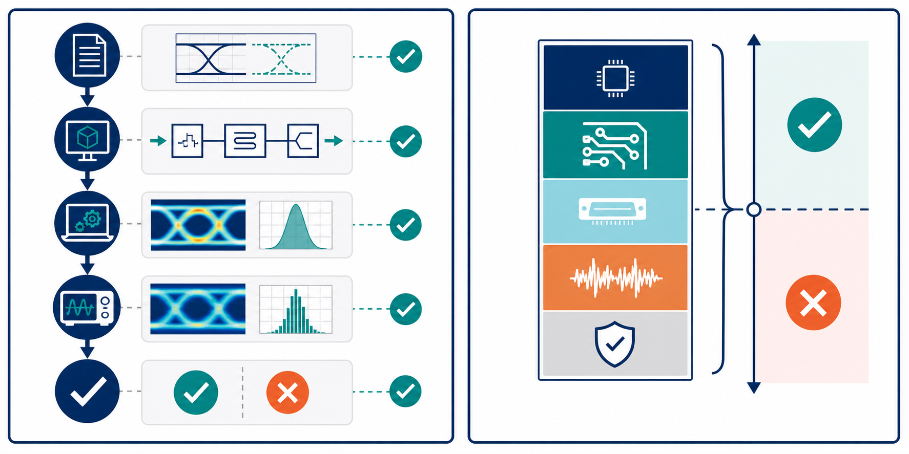

# 12：系統級 SI／PI sign-off



## 先記住這三句話

**Sign-off 不是說「模擬跑完了」，而是有證據證明設計符合規格。**

**每個結論都要能追溯到模型、設定、波形和量測。**

**真正的工程成果，是把分析結果變成下一個設計可以使用的規則。**

## 1. Sign-off 要回答什麼？

**一份 sign-off 報告要讓別人知道：測了什麼、怎麼測、結果是多少、還有什麼風險。**

至少要回答：

- 規格是多少？
- 使用了哪些模型和版本？
- 哪些 corner 被分析？
- 哪些波形或曲線代表通過？
- 還剩多少 margin？
- 哪些條件沒有被驗證？

## 2. 從規格建立 budget

**Budget 是先把有限的 margin 分給不同誤差來源。**

假設一個通道允許的總 timing 誤差是 100 ps，可以先分配：

| 誤差來源 | 預算 |
|---|---:|
| package | 20 ps |
| PCB routing | 25 ps |
| connector | 15 ps |
| jitter | 25 ps |
| 預留空間 | 15 ps |

```text
20 + 25 + 15 + 25 + 15 = 100 ps
```

這不是唯一分法，但它讓團隊知道哪一項超標，以及超標後會吃掉誰的空間。

## 3. 報告怎麼寫才有用？

### 第一層：先講結論

例如：「目前通道在最差 corner 的 eye width 是 72 ps，規格要求 60 ps，因此剩餘 margin 是 12 ps。」

### 第二層：放證據

附上拓撲、模型版本、模擬設定、關鍵波形和量測比對。

### 第三層：寫限制

如果只有典型溫度被分析，就要明確寫出來，不要讓讀者以為所有 corner 都通過。

## 4. 設計審查的兩個選擇

### A. 追求更高 margin

增加線距、改善終端、縮短回流路徑或調整 equalization。優點是風險較低，缺點是可能增加成本和面積。

### B. 接受較小 margin

保留目前設計，透過量測、製程控制或韌體補償管理風險。只有在風險已被量化、且團隊接受限制時才適合使用。

我會先選 A，除非 B 的風險已經有量測證據支持。

## 小練習

某高速通道規格要求 eye width 至少 60 ps，三個 corner 結果為 72 ps、65 ps 和 54 ps。

1. 這個設計能不能直接 sign-off？
2. 哪一個 corner 需要優先調查？
3. 報告中應該如何描述目前的結論和限制？

## 一句話結論

**Sign-off 的終點不是一張漂亮的圖，而是一套別人能重現、審查、追蹤並用於下一次設計的證據。**
