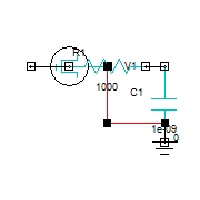

# 第一個 Ansys Circuit 暫態分析

這是一個給初學者的最小練習：用一個 1 V 脈衝，經過 1 kΩ 電阻，去充電 1 nF 電容。

你先不用急著學很多 Ansys 功能。這一課只練習四件事：放元件、接線、設定求解、看懂結果。

## 你會看到什麼



左邊是脈衝電壓源，中間是電阻，右邊是電容，最下方是接地。訊號從左往右走，最後把電容充電。

## 先記住一個生活比喻

把電壓想成水壓：

- 電壓源像水泵。
- 電阻像一段比較窄的水管，限制流量。
- 電容像水桶，會慢慢裝水。
- 接地像水流回去的出口。

所以電容不會瞬間從 0 V 跳到 1 V，而是會慢慢上升。

## 參數

| 元件 | 設定 | 白話意思 |
|---|---:|---|
| 電壓源 | 0 V → 1 V | 給電路一個階躍刺激 |
| 電阻 R1 | 1 kΩ | 限制充電速度 |
| 電容 C1 | 1 nF | 暫時儲存電荷 |
| 暫態時間 | 5 ns | 觀察電壓如何隨時間改變 |

這個電路的時間常數是：

`τ = R × C = 1 kΩ × 1 nF = 1 ns`

大約經過 1 ns，電容會充到最後電壓的 63％左右。這不是要背公式，而是幫你建立「電阻越大或電容越大，反應越慢」的直覺。

## 用 AEDT 2026 R1 操作

### 方法 A：用已完成的專案

1. 將 `SIPI_Basic_RC_Transient.aedt` 複製到純英文路徑，例如：`D:\SIPI_Ansys_Basic`。
2. 用 Ansys Electronics Desktop 2026 R1 開啟專案。
3. 在左側找到 `Basic_RC_Transient_Solved`。
4. 打開 Circuit Design，確認電路圖與元件數值。
5. 找到 `TransientSetup`，確認模擬時間是 `5ns`。
6. 執行 Analyze。

### 方法 B：用 PyAEDT 自動建立

這個方法會從外部 Python 執行，**不是**在 AEDT 裡使用 `Run Script`。

先準備：

- Ansys Electronics Desktop 2026 R1。
- Python 3.10 或相容的 Python 環境。
- `ansys-aedt-core`，也就是 PyAEDT。
- 建議使用純英文的工作目錄：`D:\SIPI_Ansys_Basic`。

在 PowerShell 執行：

```powershell
python -m pip install ansys-aedt-core
python .\run_basic_rc.py
```

若你的工作目錄不是教材資料夾，請先把 `run_basic_rc.py` 複製過去，並確認 `PROJECT_PATH` 指向純英文路徑。

## 初學者檢查表

- [ ] 電壓源、電阻、電容都有出現在圖上。
- [ ] 所有線都有接到元件端點，不只是看起來碰到。
- [ ] 電路有 GND。
- [ ] `TransientSetup` 的時間範圍是 `5ns`。
- [ ] Analyze 後沒有紅色錯誤。
- [ ] 你能說出哪一個元件控制充電速度。

## 練習題

只改一個數值，再重新求解：

1. 把 R1 從 `1 kΩ` 改成 `2 kΩ`，觀察充電是否變慢。
2. 把 C1 從 `1 nF` 改成 `2 nF`，觀察充電是否變慢。
3. 把 R1 改成 `0 Ω`，想一想這時候電容還會不會慢慢充電。

## 這一課的重點

模擬不是只看最後一張漂亮的圖，而是要能回答：我給了什麼刺激？電路怎麼回應？哪個參數改變了結果？

下一步可以把這個 RC 電路換成真正的傳輸線，觀察負載不匹配時的反射。
