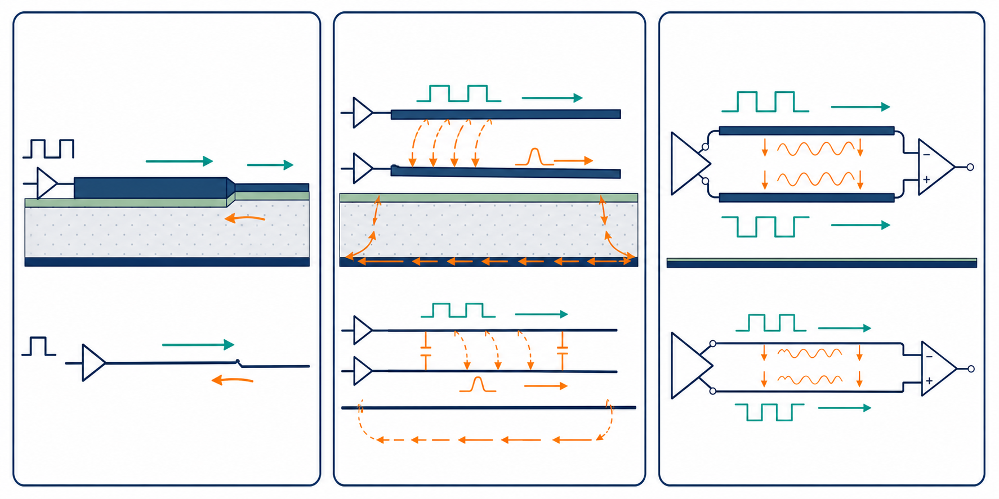

# 插圖示範：三個 SI 核心觀念

這張圖示範如何把抽象的 SI 概念畫成初學者看得懂的示意圖。



## 左圖：反射

訊號沿著傳輸線往前走，遇到線寬或阻抗改變的地方後，一部分能量會往回走。圖中的綠色箭頭是前進波，橘色箭頭是反射波。

教學時可以接著問：

- 哪裡可能是阻抗不連續？
- 反射波為什麼會向左走？
- 如果終點匹配，橘色箭頭會不會消失？

## 中圖：串擾與回流

上方的線是 aggressor，下方的線是 victim。上方訊號切換時，電場和磁場會把一部分變化耦合到下方線，造成橘色的干擾波形。

下方的橘色箭頭表示回流路徑。回流如果必須繞遠路，電磁場會擴散，串擾和輻射通常會更難控制。

教學時可以接著問：

- 哪一條是 aggressor？哪一條是 victim？
- 平行長度變短會發生什麼事？
- 參考平面中斷時，回流要走哪裡？

## 右圖：差動訊號

上方和下方兩條線傳送大小相近、方向相反的訊號。中間的橘色波形代表外界同時加到兩條線上的共模雜訊。

接收器看的是兩條線的差值。如果兩條線受到完全相同的干擾，干擾在相減時會被抵消；如果兩條線不對稱，部分干擾就會留下來。

教學時可以接著問：

- 為什麼 P、N 兩條線要盡量對稱？
- 如果只有 P 線靠近另一條高速線，會發生什麼事？
- via 數量不同，會不會破壞差動效果？

## Markdown 嵌入方式

```markdown

```

## 這種插圖適合放在哪裡？

- 每一章的開頭，用來先建立直覺。
- 公式前面，用圖說明公式描述的物理現象。
- 小練習前面，讓學員先看圖猜答案。
- 課程簡報或講義的章節總結頁。
