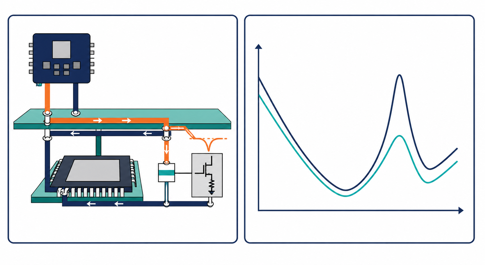

# 試閱三：PDN 與去耦的第一個觀念



## 先記住這三句話

**晶片突然要電時，PDN 就像供水管路。**

**電源雜訊大小，大致等於 PDN 阻抗乘上電流變化。**

**電容不是越多越好，位置和頻率一樣重要。**

## 1. PDN 是什麼？

**PDN 是把電源送到晶片的完整路徑。**

它通常包含：

```text
VRM → PCB power plane → package → die capacitor → switching load
```

可以把它想成供水系統：VRM 是水塔，power plane 是水管，晶片是用水量會突然變化的工廠。

如果晶片突然多用 0.5 A，而這條「水管」在該頻率的阻抗是 40 mΩ，電壓擾動約為：

```text
ΔV = 0.5 A × 0.04 Ω = 0.02 V = 20 mV
```

如果規格只允許 10 mV，20 mV 就不合格。

## 2. 為什麼要看頻率？

**同一個 PDN，在 1 MHz 和 100 MHz 可能是兩個完全不同的系統。**

慢慢變化的電流，可能由 VRM 和 bulk capacitor 處理；快速變化的電流，通常需要靠近晶片的低電感路徑處理。

所以不能只問「有幾顆電容」，還要問它們負責哪個頻率範圍，以及電流要經過多少 via 和 plane。

## 3. 實際電容和想像中的電容不同

**理想電容頻率越高，阻抗越低；實際電容超過某個頻率後，反而會變得像電感。**

原因是實際電容還有 ESR、ESL、元件本體、焊墊和 via 的寄生效應。

在低頻，電容效果比較明顯；接近自諧振頻率時，阻抗最低；超過自諧振頻率後，ESL 開始主導。

## 4. 為什麼加很多電容仍然可能變差？

**不同電容、plane 和封裝互相作用時，可能在某個頻率製造更高的阻抗尖峰。**

這叫反諧振。它像兩個人一起推鞦韆，時機不對時，反而讓某個方向的擺動變大。

因此增加電容後，要重新看完整的 `ZPDN` 曲線。不能只看總電容量從 100 μF 增加到 200 μF，就直接宣布改善。

## 5. 第一版 PDN 分析照這六步做

1. 寫下最大電流變化量與允許電壓雜訊。
2. 算出目標阻抗：允許電壓雜訊 ÷ 電流變化量。
3. 把 VRM、plane、package、電容和 load 放進模型。
4. 掃描頻率，畫出 PDN 阻抗曲線。
5. 找出超過目標阻抗的尖峰。
6. 一次只改一個因素，再重新驗證。

若目標是 10 mV、電流變化是 0.5 A，目標阻抗就是：

```text
10 mV ÷ 0.5 A = 20 mΩ
```

## 小練習

某負載在一個頻率的電流變化量是 0.5 A，PDN 阻抗是 40 mΩ。

1. 電壓擾動是多少？
2. 如果允許值是 10 mV，目標阻抗是多少？
3. 如果 100 MHz 出現尖峰，你會先檢查電容、via，還是 plane resonance？

## 一句話結論

**PI 的第一個問題不是「我要加幾顆電容」，而是「哪個頻率的電流，經過哪一條路徑，造成了多少電壓變化」。**
