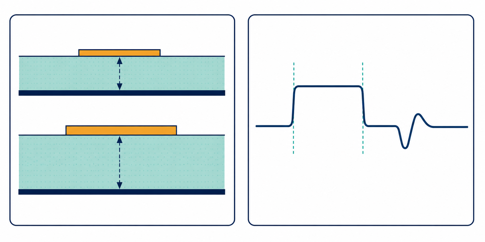

# 試閱四：傳輸線與阻抗



## 先記住這三句話

**阻抗不是電阻；它是訊號在一條線上前進時看到的「道路寬度」。**

**線寬、線距、介質和參考平面改變，阻抗就會改變。**

**高速設計要讓訊號看到的道路盡量連續。**

## 1. 阻抗是什麼？

**阻抗可以想成道路對車流的影響。**

電阻比較像水管裡固定的摩擦；阻抗則包含訊號變化速度、電容、電感和幾何結構的綜合影響。

一條 PCB 線的阻抗會受到這些因素影響：

- 線寬：線越寬，通常阻抗越低。
- 線到參考平面的距離：距離越近，通常阻抗越低。
- 介電常數：材料不同，訊號速度和阻抗也不同。
- 銅厚和表面粗糙度：會影響損耗。
- 鄰近線路：會產生耦合和串擾。

## 2. 為什麼要控制 50 Ω 或 100 Ω？

**目標阻抗的真正目的，是讓訊號沿路看到接近一致的環境。**

單端線常見 50 Ω，差動 pair 常見 90 Ω 或 100 Ω。這些數字不是永遠正確的答案，而是由 driver、receiver、協定和 stackup 共同決定的設計目標。

例如，一條 50 Ω 線突然接到 75 Ω 結構，反射係數為：

```text
Γ = (75 − 50) / (75 + 50) = 0.2
```

也就是約 20% 的電壓波會反射回去。阻抗差不是「差一點點」，而是會直接變成波形上的額外波動。

## 3. 參考平面為什麼重要？

**訊號線下面的參考平面，就是訊號回流的主要道路。**

如果 signal trace 從 Layer 1 換到 Layer 3，而回流沒有透過合適的 stitching via 跟著換層，回流就要繞遠路。

這會增加迴路面積，讓訊號更容易出現：

- 阻抗不連續。
- 額外輻射。
- 串擾增加。
- 差動訊號轉成 common mode。

## 4. 用 TDR 看道路哪裡變窄

TDR 可以想成拿手電筒沿著道路照，從回來的反射判斷哪裡有障礙物。

- 波形向上：通常代表局部阻抗變高。
- 波形向下：通常代表局部阻抗變低。
- 反射出現的時間：可以推估問題距離。

如果訊號在 1 ns 後看到反射，而線上的傳播速度約為 150 mm/ns，問題距離要考慮訊號往返，因此大約在：

```text
150 mm/ns × 1 ns ÷ 2 = 75 mm
```

這是初步估算，實際數值還要看 stackup 和傳播速度。

## 5. 設計時先做哪兩件事？

### A. 先固定 stackup

先確定線寬、銅厚、介質厚度和參考平面，再談阻抗。沒有 stackup，單獨說「線寬要 5 mil」通常沒有意義。

### B. 再檢查轉換位置

優先檢查 via、connector、BGA breakout、plane split 和線寬突然改變的地方。這些位置最容易造成局部阻抗變化。

## 小練習

一條線的 TDR 在 75 mm 附近出現向上的尖峰。

1. 你會先猜阻抗變高還是變低？
2. 你會檢查線寬變化、via，還是參考平面？
3. 如果訊號剛好在這裡換層，回流路徑要如何確認？

## 一句話結論

**阻抗控制的目標不是讓每一段數字都漂亮，而是讓訊號沿著整條路走時，不要突然遇到窄橋或斷路。**
