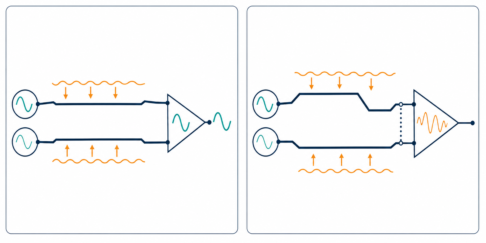

# 試閱六：差動訊號為什麼比較抗干擾？



## 先記住這三句話

**差動訊號不是兩條一模一樣的線而已，而是接收器看兩條線的差值。**

**兩條線越不對稱，差動訊號越容易變成 common mode 雜訊。**

**差動 pair 要一起走，也要一起經過每一個結構。**

## 1. 差動訊號怎麼傳資料？

**接收器不是只看其中一條線，而是計算正線和負線的電壓差。**

假設：

- P 線是 +0.4 V。
- N 線是 −0.4 V。

差動電壓就是：

```text
Vdiff = VP − VN = 0.4 − (−0.4) = 0.8 V
```

如果外界雜訊同時讓兩條線都增加 0.1 V：

```text
VP = 0.5 V，VN = −0.3 V
Vdiff = 0.5 − (−0.3) = 0.8 V
```

差值沒有改變，所以理想情況下，接收器不太在意這種同時出現的雜訊。

## 2. 為什麼差動線仍然會出問題？

**差動抗干擾的前提，是兩條線真的受到相同的影響。**

如果 P 線和 N 線經過的結構不同，外界干擾就不會平均分到兩條線上。

常見原因包括：

- P、N 線長不同。
- via 數量或形狀不同。
- 一條線靠近 aggressor，另一條沒有。
- 差動 pair 中間距離忽近忽遠。
- 一條線跨過參考平面不連續的位置。

結果是原本想要的差動訊號，部分變成 common mode。這叫 mode conversion，可以理解成「兩人一起唱歌」變成「其中一人突然走音」。

## 3. 差動阻抗和單端阻抗不同

**差動阻抗不是把兩條單端阻抗直接相加。**

兩條線彼此靠近時，會互相耦合，所以 pair 的阻抗會受到線距影響。常見設計目標有 90 Ω 或 100 Ω，但最後仍要依協定、stackup 和元件規格決定。

線距縮小通常會讓耦合變強，也會改變差動阻抗。線距突然變化，就像道路寬度突然改變，可能產生反射。

## 4. Intra-pair skew 是什麼？

**Intra-pair skew 就是 P 線和 N 線抵達時間不同。**

假設 P 線比 N 線長 1 mm，而訊號在板上的速度約為 150 mm/ns，時間差約為：

```text
1 mm ÷ 150 mm/ns = 6.7 ps
```

在低速介面，6.7 ps 可能不重要；在 112 Gb/s 或 224 Gb/s 等高速系統，這種差異就可能影響 eye 和 BER。

## 5. 差動 pair 的 layout 檢查順序

1. 確認 P、N 的線長差符合規格。
2. 確認兩條線的線距盡量穩定。
3. 確認 via、pad、neck-down 和 connector 結構對稱。
4. 確認參考平面連續，換層時回流有路可走。
5. 檢查 pair 是否靠近其他高速 aggressor。

## 小練習

一組差動訊號中，P 線比 N 線長 3 mm，板上傳播速度估計為 150 mm/ns。

1. 兩條線大約有多少時間差？
2. 如果兩條線同時受到 0.1 V 雜訊，差動電壓會不會改變？
3. 如果只有 P 線靠近另一條高速 aggressor，最可能出現什麼問題？

## 一句話結論

**差動訊號之所以抗干擾，是因為兩條線夠對稱；設計工作的重點，就是保護這個對稱性。**
