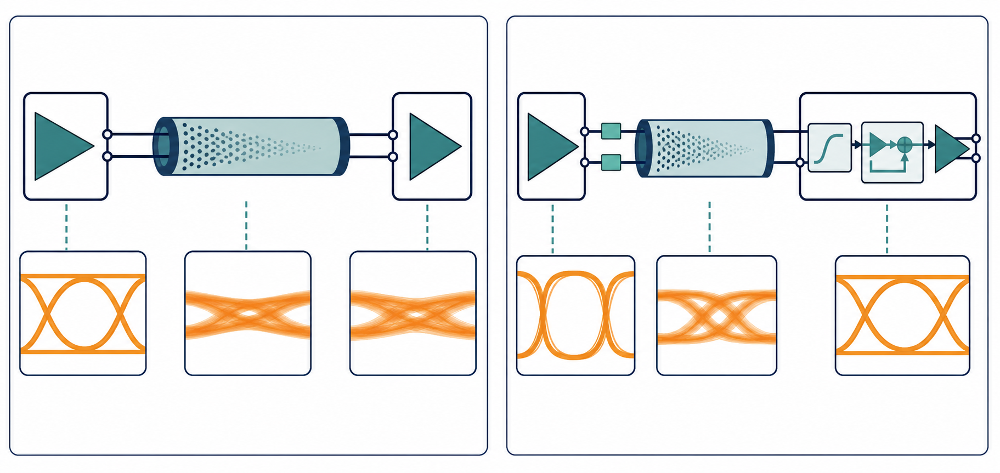

# 試閱十：SerDes、Equalization 與 IBIS-AMI

## 先記住這三句話

**SerDes 是把高速平行資料變成高速串列資料，再在另一端還原。**

**通道損耗會把眼睛慢慢閉起來，equalization 是用來把眼睛打開。**

**IBIS-AMI 用演算法描述高速收發器如何補償通道。**

## 1. SerDes 在做什麼？

**SerDes 把很多條低速資料，整理成少數幾條高速通道。**

它通常包含：

- transmitter：送出高速訊號。
- channel：經過 package、PCB、connector 和 cable。
- receiver：接收並恢復資料。

速度越高，同一個 bit 的時間越短，通道損耗和反射就越容易佔掉可用 margin。

## 2. ISI 是什麼？

**ISI 就是前一個 bit 的尾巴還沒消失，下一個 bit 就來了。**

想像你用粉筆在黑板上快速畫線。上一筆還沒擦乾淨，下一筆又疊上去，最後看到的形狀就不清楚。

通道損耗越大，高頻邊緣越容易被削弱，ISI 越嚴重。

## 3. Equalization 怎麼幫忙？

### Pre-emphasis／De-emphasis

在 transmitter 端調整不同 bit 的振幅，讓經過通道損耗後的波形比較平衡。

### CTLE

在 receiver 前端提升高頻成分，補回通道吃掉的部分能量。

### DFE

根據前面已經判斷的 bit，估算並扣掉目前 bit 受到的尾巴干擾。

## 4. 什麼是 eye diagram？

**Eye diagram 是把很多段 bit 波形疊在一起，看接收器還剩多少安全空間。**

眼睛越張開，通常代表電壓和時間 margin 越大；眼睛越閉，代表通道損耗、ISI、jitter 或串擾正在吃掉餘裕。

## 小練習

一個通道讓接收端 eye height 從 400 mV 降到 250 mV。

1. 電壓 margin 減少多少？
2. 你會先嘗試 CTLE、DFE，還是修改 PCB routing？
3. 如果 equalization 能打開眼圖，但 BER 仍不好，還要檢查什麼？

## 一句話結論

**SerDes 設計不是只追求更大的輸出，而是要讓通道、equalization 和接收器判斷方式一起工作。**
